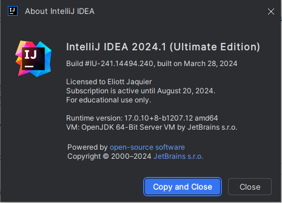
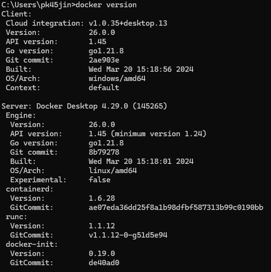
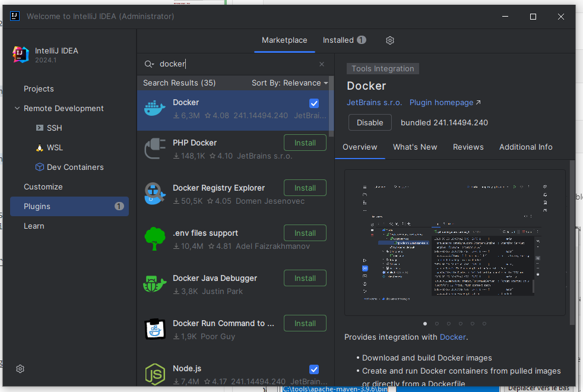
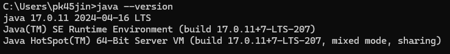
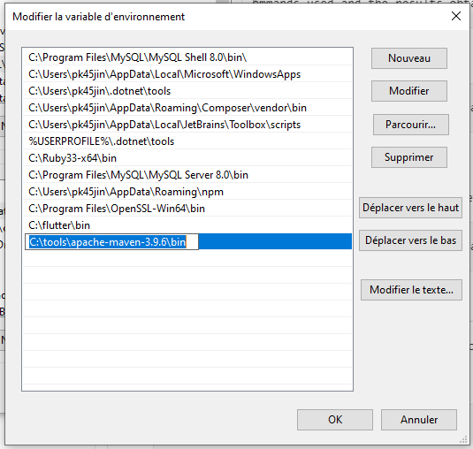
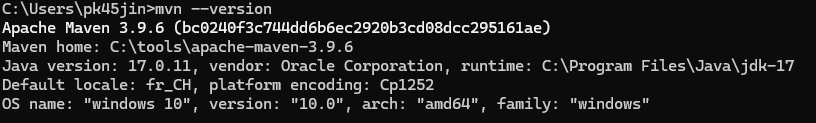
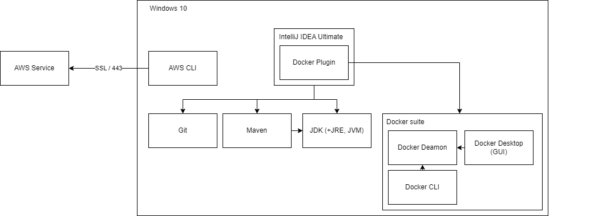

# Labo01 - Environment Setup

* [Labo description](https://cpnv-es-ngy.gitbook.io/vir1/labs/labo01-environment-setup)

## DevOps Stack to setup

Mention in this documentation the orders carried out and the results obtained.

If you have opted for a graphical installation, provide screenshots and describe the procedure up to the result obtained.

### Cloud cmd line interface - AWS Cli

Download need to be (at least v2.13) from https://awscli.amazonaws.com/AWSCLIV2.msi

```
aws --version
//Should return something like aws-cli/2.15.39 Python/3.11.8 Windows/10 exe/AMD64 prompt/off
```


### IDE - Intellij
Install IntelliJ IDEA Ultimate from https://www.jetbrains.com/idea/download/download-thanks.html?platform=windows (at least 2024)

To check the version, open IntelliJ IDEA Ultimate, click on the settings button and 'about'.

It should give you something like :



### Containers Engins - Docker
Download Docker Desktop from https://desktop.docker.com/win/main/amd64/Docker%20Desktop%20Installer.exe (at least v23)

Start docker and check your version with 

```
docker version
```
Should give something like


### Versioning - Git + Git flow
You can download Git for windows from https://github.com/git-for-windows/git/releases/download/v2.44.0.windows.1/Git-2.44.0-64-bit.exe (at least v2.44) 

NOTE : If you already have Git, you can update it with this command ([stackoverflow reference](https://stackoverflow.com/questions/13790592/how-to-upgrade-git-on-windows-to-the-latest-version)):

```
//Since Git 2.16.1(2) you can use
git update-git-for-windows

//In version between 2.14.2 and 2.16.1, the command was
git update
```

To check your version :

```
git -v
//Should give you something like 'git version 2.44.0.windows.1'
git flow version
//Should give you '1.12.3 (AVH Edition)'
```

### IDE Plugin - Docker plugin for IntelliJ
Open IntelliJ IDEA, go to plugins and type 'Docker'. Click on 'install'

You can now check the version on the right of the 'disable' button.

### Development Kit - JDK
Download latest JDK 17 from here : https://download.oracle.com/java/17/latest/jdk-17_windows-x64_bin.exe

Check your java version 
```
java --version
```
It should give you something like


Note : Be carefull if you have multiple java versions. You may need to change the version to use : https://superuser.com/questions/1057532/how-to-change-java-version-on-windows-10

### Package manager - Maven

Next, go to Control Panel > System > Advanced System Settings > Environment Variables. Click on 'Path' and add something like 'C:\tools\apache-maven-3.9.6\bin'.



You can now check version with

```
mvn --version
```

It should give you something like


## Schema

Show your development environment, mentioning all the components in the stack.

Identify the links between components.




## Analysis

Answer the questions below, giving reasons for your answer (link, source).

### AWS CLI

* How does the AWS Cli interact with the cloud ?

[By default, the AWS CLI sends requests to AWS services by using HTTPS on TCP port 443.](https://docs.aws.amazon.com/cli/latest/userguide/cli-chap-using.html)

* What other ways do we have of dialoguing/interacting with the AWS cloud if we wanted to do without the CLI?

1. AWS Management Console
2. AWS SDKs

* What commands do I need to run in the CLI to start an ec2 instance?

Go check out [User Guide](https://docs.aws.amazon.com/cli/latest/userguide/cli-services-ec2-instances.html) and [EC2 Run Instance Command Reference](https://awscli.amazonaws.com/v2/documentation/api/latest/reference/ec2/run-instances.html)
```
aws ec2 run-instances --image-id ami-xxxxxxxx --count 1 --instance-type t2.micro --key-name MyKeyPair --security-group-ids sg-903004f8 --subnet-id subnet-6e7f829e
```

### Docker Engine

* What type of hypervisor does Docker use?

```
You can have WSL2 Backend on Windows or Hyper-V.
TODO : Command to check the backend used on windows
```

* What role does the Docker Desktop play in the Docker architecture?

```
It provides a straightforward GUI (Graphical User Interface) that lets you manage your containers, applications, and images directly from your machine. On installation, it reduces the time spent on complex setups so you can focus on writing code by including Docker Engine, CLI, Scout, Build, Extension, Compose, etc...
```
See [Overview of Docker Desktop](https://docs.docker.com/desktop/)

### Java Environment

* JDK, JRE, JVM... what's the difference?


### Maven

* What is the command you need to use Maven to retrieve dependencies (and only that)?

```
mvn dependency:copy-dependencies
```


